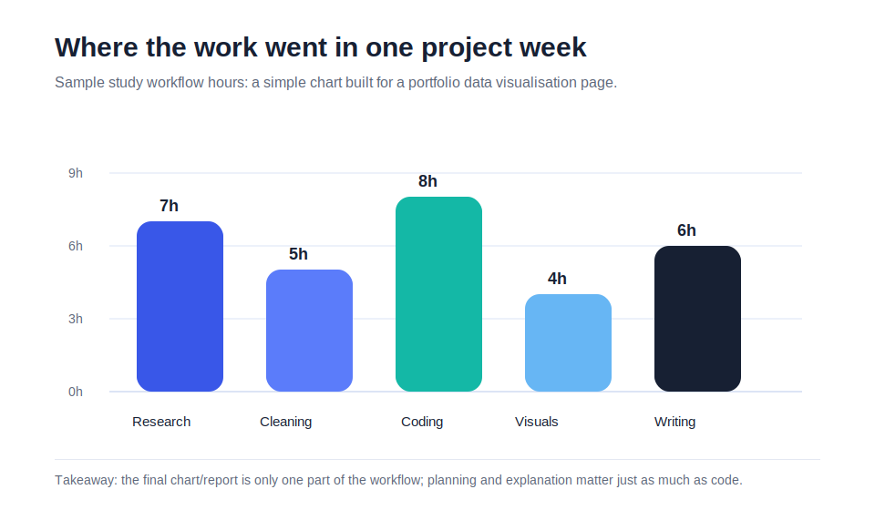

::: {.portfolio-page-header}
# Data Visualization: Study Workflow Breakdown

A simple visualisation showing how time can be distributed across different stages of a data project.
:::

::: {.portfolio-viz-frame}
{fig-alt="Bar chart showing project hours for research, cleaning, coding, visualisation, and writing"}
:::

## What the chart shows {.section-title}

The chart breaks one project week into five activities: research, data cleaning, coding, visualisation, and writing. Coding takes the largest share, but the chart also shows that the final output depends heavily on planning, cleaning, and explanation.

## The story behind it {.section-title}

When people see a finished report, they often only notice the final chart or written answer. In reality, a lot of the work happens before that: deciding what question to answer, preparing data, checking whether the output makes sense, and explaining the result clearly.

::: {.portfolio-grid .portfolio-grid-two}
::: {.portfolio-card}
### Main takeaway
A strong data project is not just about producing a graph. It is about making the graph support a clear story.
:::

::: {.portfolio-card}
### Design choice
I used a simple bar chart because the comparison is direct. The viewer can immediately see which parts of the workflow took more time.
:::
:::
