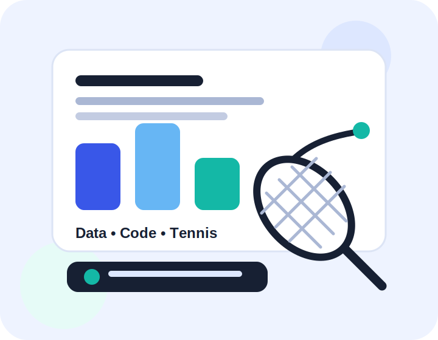

::: {.hero}
::: {.hero-copy}
Portfolio website · Quarto

# Hi, I'm Evan.

I'm a student interested in data analytics, automation, markets, and building practical things that turn messy information into clear decisions. This site collects a few pieces of work, learning reflections, and personal interests in one clean place.

::: {.button-row}
[View my project](project.qmd){.btn .btn-primary}
[See a data visualisation](data-visualization.qmd){.btn .btn-outline}
:::
:::

::: {.hero-visual}
{fig-alt="Illustration of data charts, code and tennis representing Evan's interests"}
:::
:::

## What this site shows {.section-title}

::: {.grid}
::: {.card}
### Data and automation
I enjoy using code to reduce repetitive work, test ideas properly, and present outputs in a way that is easy to understand.
:::

::: {.card}
### Learning by building
My best learning usually happens when I turn concepts into a real artefact: a dashboard, a report, a small model, or a website like this.
:::

::: {.card}
### Outside class
Tennis is one of my favourite hobbies because it combines technique, discipline, timing, and constant improvement.
:::
:::

## Current focus {.section-title}

::: {.grid .two}
::: {.card}
### What I am improving
- Building clearer data stories, not just charts.
- Writing cleaner reports using Quarto.
- Making technical work presentable to non-technical readers.
:::

::: {.card}
### What I value in projects
- Simple structure.
- Honest explanation of assumptions.
- Visuals that support the message.
- Work that looks polished enough to share.
:::
:::
